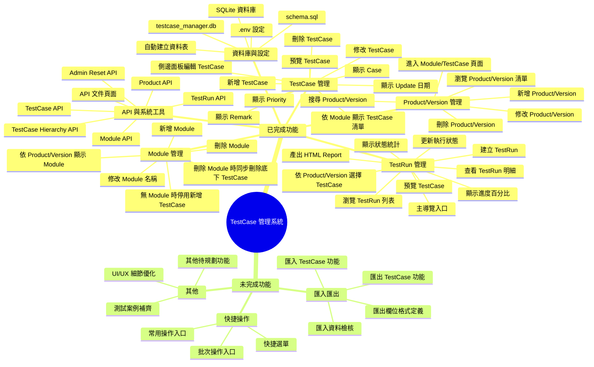

# TestCase 管理系統運作心智圖

此心智圖以「功能使用」為主，用來描述目前系統可操作的功能範圍，並作為後續撰寫 TestCase 的依據。

狀態標示：

- `[已完成]`：目前系統已具備，或已有可操作的頁面/API
- `[未完成]`：已列入規劃，但尚未完成或仍需重構

## 維護規則

每次完成或調整功能時，請同步更新此心智圖：

- 將完成的節點由 `[未完成]` 改為 `[已完成]`
- 新增功能時，先放入對應分類並標示狀態
- 若功能範圍改變，請同步調整節點名稱，避免後續 TestCase 依據過期
- 若功能已有明確測試情境，可在節點下方新增更細的操作項目
