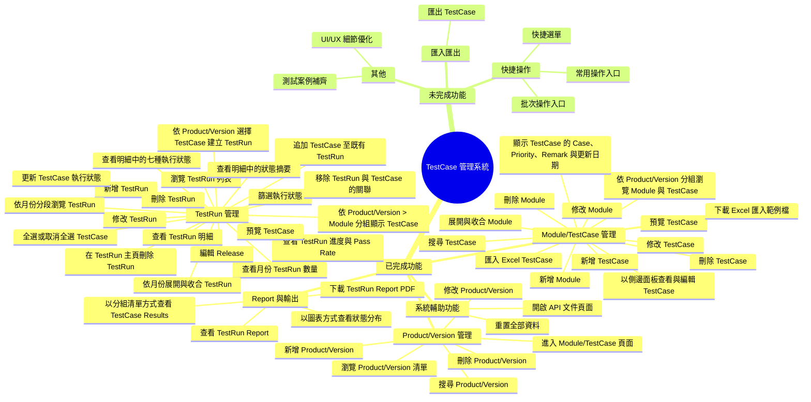

# TestCase 管理系統運作心智圖

此心智圖以「使用者可操作的功能」為主，用來描述目前系統的操作範圍，並作為後續撰寫 TestCase 的依據。

狀態標示：

- `[已完成]`：目前系統已具備，或已有可操作的頁面
- `[未完成]`：已列入規劃，但尚未完成或仍需重構

```mermaid
mindmap
  root((TestCase 管理系統))
    已完成功能
      Product/Version 管理
        瀏覽 Product/Version 清單
        新增 Product/Version
        修改 Product/Version
        刪除 Product/Version
        搜尋 Product/Version
        進入 Module/TestCase 頁面
      Module/TestCase 管理
        依 Product/Version 分組瀏覽 Module 與 TestCase
        展開與收合 Module
        新增 Module
        修改 Module
        刪除 Module
        新增 TestCase
        修改 TestCase
        刪除 TestCase
        預覽 TestCase
        以側邊面板查看與編輯 TestCase
        搜尋 TestCase
        顯示 TestCase 的 Case、Priority、Remark 與更新日期
        匯入 Excel TestCase
        下載 Excel 匯入範例檔
      TestRun 管理
        瀏覽 TestRun 列表
        新增 TestRun
        修改 TestRun
        刪除 TestRun
        依月份分段瀏覽 TestRun
        查看月份 TestRun 數量
        依月份展開與收合 TestRun
        查看 TestRun 進度與 Pass Rate
        在 TestRun 主頁刪除 TestRun
        編輯 Release
        依 Product/Version 選擇 TestCase 建立 TestRun
        全選或取消全選 TestCase
        預覽 TestCase
        更新 TestCase 執行狀態
        查看 TestRun 明細
        依 Product/Version > Module 分組顯示 TestCase
        篩選執行狀態
        追加 TestCase 至既有 TestRun
        移除 TestRun 與 TestCase 的關聯
        查看明細中的七種執行狀態
        查看明細中的狀態摘要
      Report 與輸出
        查看 TestRun Report
        下載 TestRun Report PDF
        以圖表方式查看狀態分布
        以分組清單方式查看 TestCase Results
      系統輔助功能
        開啟 API 文件頁面
        重置全部資料
    未完成功能
      匯入匯出
        匯出 TestCase
      快捷操作
        快捷選單
        常用操作入口
        批次操作入口
      其他
        UI/UX 細節優化
        測試案例補齊
```
